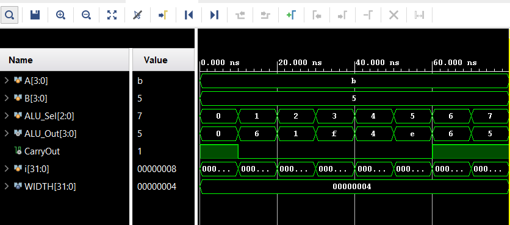

# Task 1: Arithmetic Logic Unit (ALU)

## 📌 Objective
Design a basic **Arithmetic Logic Unit (ALU)** in Verilog that supports fundamental operations such as:
- Addition
- Subtraction
- AND
- OR
- NOT
- XOR
- Shift Left
- Shift Right

---

## 📂 Files
- `ALU.v` → Verilog module for the ALU (parameterized width).
- `ALU_tb.v` → Testbench to verify all ALU operations.
- `simulation/` → Waveform screenshots and logs (to be added after simulation).

---

## 🔧 Features
- **Parameterizable Width**: Currently set to 4 bits (`WIDTH = 4`).
- **Operations** (selected using `ALU_Sel` control):
  - `000` → ADD
  - `001` → SUB
  - `010` → AND
  - `011` → OR
  - `100` → NOT (on A)
  - `101` → XOR
  - `110` → Shift Left
  - `111` → Shift Right
- Outputs:
  - `ALU_Out` → result of operation
  - `CarryOut` → carry or borrow flag (for ADD/SUB/shift)

---

## ▶️ How to Simulate in Vivado
1. Open **Vivado** → Create a new RTL project.
2. Add `ALU.v` as **Design Source**.
3. Add `ALU_tb.v` as **Simulation Source**.
4. Set **`ALU_tb`** as the simulation top module.
5. Run **Behavioral Simulation**.
6. Observe signals: `A`, `B`, `ALU_Sel`, `ALU_Out`, `CarryOut`.

---

## 🖥️ Example Simulation
For inputs:
- `A = 1011` (11 in decimal)
- `B = 0101` (5 in decimal)

The testbench cycles through all operations (`ALU_Sel = 000 → 111`) and prints results:
TIME | A | B | SEL | OUT | CARRY
0 | 1011 | 0101 | 000 | 0000 | 1 // ADD 11+5=16 (carry=1)

10 | 1011 | 0101 | 001 | 0110 | 0 // SUB 11-5=6

20 | 1011 | 0101 | 010 | 0001 | 0 // AND

30 | 1011 | 0101 | 011 | 1111 | 0 // OR

40 | 1011 | 0101 | 100 | 0100 | 0 // NOT (A)

50 | 1011 | 0101 | 101 | 1110 | 0 // XOR

60 | 1011 | 0101 | 110 | 0110 | 1 // Shift Left

70 | 1011 | 0101 | 111 | 0101 | 1 // Shift Right

---

## 📊 Simulation Waveform

---

## 📊 Deliverables
- ✅ Verilog code for ALU
- ✅ Testbench with automatic stimulus
- ✅ Simulation output log and waveforms
---
⚙️ Uses of ALU

The Arithmetic Logic Unit (ALU) is one of the most important building blocks of any digital system. Its main applications include:

- Microprocessors & CPUs: ALU performs the core arithmetic and logic operations in every instruction cycle. Used in Intel, AMD, ARM processors.
- Embedded Systems: ALU inside microcontrollers (like ARM Cortex-M, PIC, AVR) processes sensor data, control algorithms, and real-time operations.
- Digital Signal Processing (DSP): High-speed ALUs are used for filtering, FFT, image and audio processing.
- Graphics Processing Units (GPUs): ALUs execute large numbers of mathematical operations in parallel for rendering and AI workloads.
- Scientific and Engineering Applications: Any computation-heavy system (simulation, robotics, machine learning accelerators) depends on ALU operations.
- Control Units in VLSI Designs: ALUs form a core component in designing custom processors, ASICs, and FPGAs.

---

✍️ Author

Name: Saurabh Kamble

GitHub: https://github.com/Ayanokouji707

